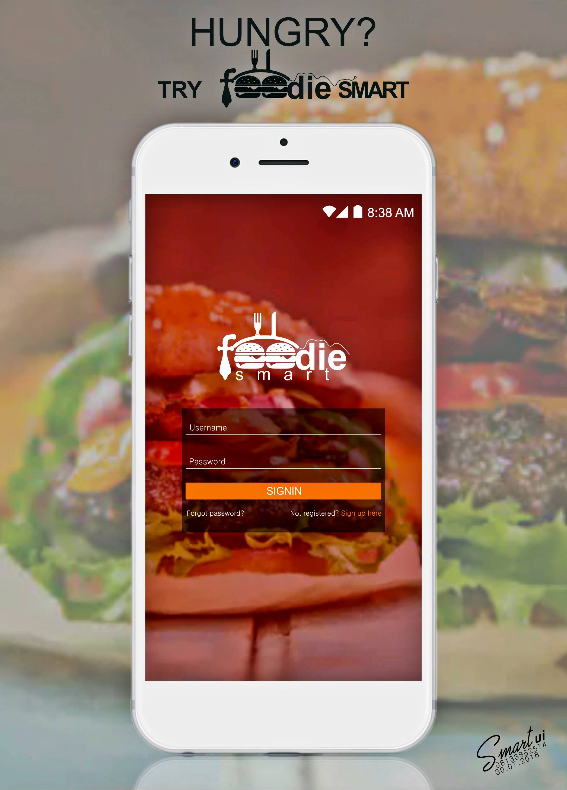

# Foodie Smart
Foodie Smart is a simple User Interface I created for [Facebook Developer Circle: Uyo](https://web.facebook.com/groups/DevCUyo/) to educate Android beginners on
basic concepts of Android App Development.
This project basically covers:
1. ViewGroups (Relative and Linear Layouts)
2. TextViews
3. ImageViews
4. EditText
5. Buttons, Etc

__This project is meant for newbies, as such the techniques have been reduced to the minimum level.__

Thanks! :wink:

